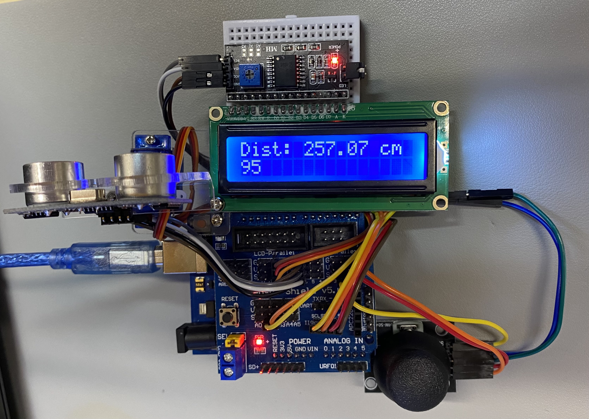

# Project 01

这个 ReadMe 就用中文边当博客边当介绍来写了。

之前闲来搜出了本科时候玩的 Arduino，于是上淘宝找几个元件，现代工业发展真是给力，好多元件只要一两块还包邮，淘宝还给我送几毛钱的小红包，买一个送一个，买了一堆也没花多少钱。看着一堆零件我就计划着装个什么东西出来，于是就有了这个 Project。

## 介绍

这个 Project 是把一堆元件拼到一起，组成了一个用遥杆控制舵机使超声波测距模块转向同时将测距结果输出到 LCD 屏幕上的东西。

这个 Project 并不是为了解决什么问题而诞生的，纯属为了乐趣，所以可能连 GitHub 手工耿都算不上。

## 用到的元件

| 名称                 | 型号               | 淘宝价格 |
| -------------------- | ------------------ | -------- |
| 舵机和支架           | DXW90(SG90)        | ￥4.10   |
| 超声波测距模块和支架 | HC-SR04            | ￥4.95   |
| LCD 显示模块         | LCD1602            | ￥4.60   |
| LCD 转 I2C 模块      | PCF8574            | ￥3.22   |
| PS2 摇杆模块         | -                  | ￥3.43   |
| Arduino Shield       | Sensor Shield v5.0 | ￥5.90   |
| 迷你面包板           | -                  | ￥1.05   |
| 杜邦线               | -                  | ￥2.00   |

## 编程

Arduino 的编程真是太简单了，几乎所有东西都有现成的库，真就像拼积木一样把元件拼起来，然后再把各个库的示例代码拼起来就能跑了。

要做的就是连连线，然后把对应的 GPIO 选对就行了。

## 最终成品

