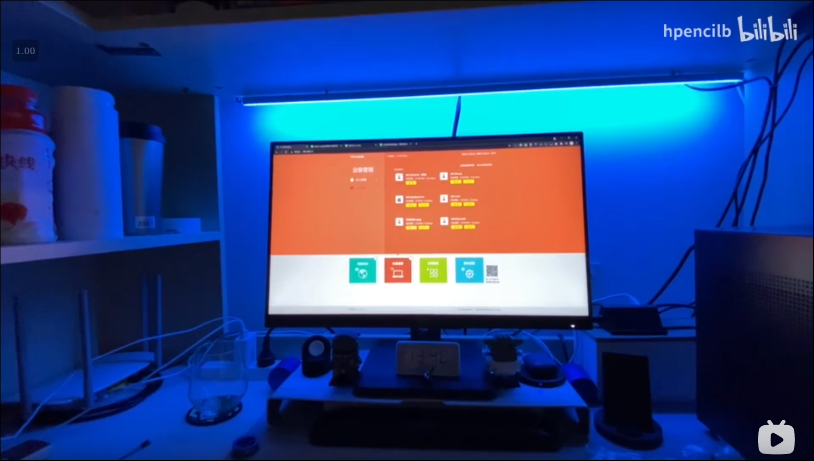

# Project 02

这个 Project 是我了解到了 ESP8266 和 [Mixiaoxiao](https://github.com/Mixiaoxiao) 大佬的 [Arduino-HomeKit-ESP8266](https://github.com/Mixiaoxiao/Arduino-HomeKit-ESP8266) 之后想到做的。

## 介绍

买了一根 60 颗灯珠的 WS2812B LED 灯带和一根铝合金灯槽然后用了 ESP01S 接入了 HomeKit，做了一个低成本并且效果还算过得去的氛围灯。做完之后发现 ESP01S 的 GPIO 2 启动时候会被拉高，如果接地就无法启动，无奈加了个自锁按钮，需要等 ESP 启动完成才能实现对灯的控制，但这也只是第一次通电才会有的问题，连上 WiFi 后就不必操心了。

## 用到的元件

| 名称            | 型号            | 淘宝价格 |
| --------------- | --------------- | -------- |
| LED 灯带 1 米   | WS2812B(60 LED) | ￥18.30  |
| 铝合金灯槽 1 米 | LS-1616         | ￥5.50   |
| 5V5A 电源       | -               | ￥11.00  |
| DC 母头转接口   | -               | ￥1.20   |
| 5V 转 3V 模块   | AMS1117-3.3     | ￥0.70   |
| ESP8266         | ESP-01S         | ￥5.30   |
| 2cm*8cm 洞洞板  | -               | ￥0.48   |
| 杜邦线          | -               | ￥0.50   |

## 编程

软件部分其实就是 [Arduino-HomeKit-ESP8266](https://github.com/Mixiaoxiao/Arduino-HomeKit-ESP8266) 的 Example 05，改了一下灯珠的个数和相应的管脚。就是这个 [ESP01S_WS2812](../ESP01S_WS2812/)。

## 最终成品

在 Home APP 里转圈圈调整颜色的效果：

