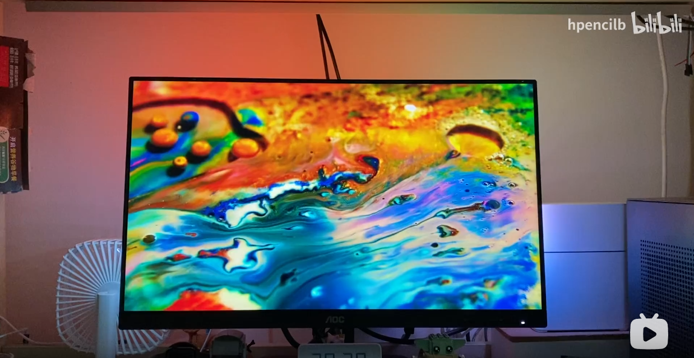

# Project 03

这个 Project 主要是新整了几块（貌似是山寨的）D1 mini，于是想做一个显示器氛围灯，用到了 [Prismatik](https://github.com/psieg/Lightpack) 和 [WLED](https://github.com/Aircoookie/WLED)。

## 介绍

前段时间找了不少 ESP8266 和 WS2812B 的项目，比较知名的几个像是 [AWTRIX](https://awtrixdocs.blueforcer.de/#/en-en/README) 和 Prismatik，逻辑都是单片机做客户端直接显示服务端给的指令。\
网上搜了一些显示器氛围灯的教程，有些虽然用了 Prismatik 但走的是串口通信，要把单片机插在电脑上，还要外接一个供电给 LED，感觉很拖沓，而且不用 WLAN 何必用 ESP 的芯片呢。

## 编程

就是[刷WLED的固件](https://install.wled.me/)，稍微连一下电路，[安装](https://github.com/psieg/Lightpack/releases)配置一下 IP，然后选 UDP device 就能用。

## 用到的元件

| 名称         | 型号              | 淘宝价格   |
| ---------- | --------------- | ------ |
| LED 灯带 1 米 | WS2812B(60 LED) | ￥14.70 |
| 5V5A 电源    | -               | ￥11.00 |
| DC 母头转接口   | -               | ￥1.20  |
| ESP8266    | D1 mini         | ￥9.10  |
| 杜邦线        | -               | ￥0.50  |

## 最终成品

